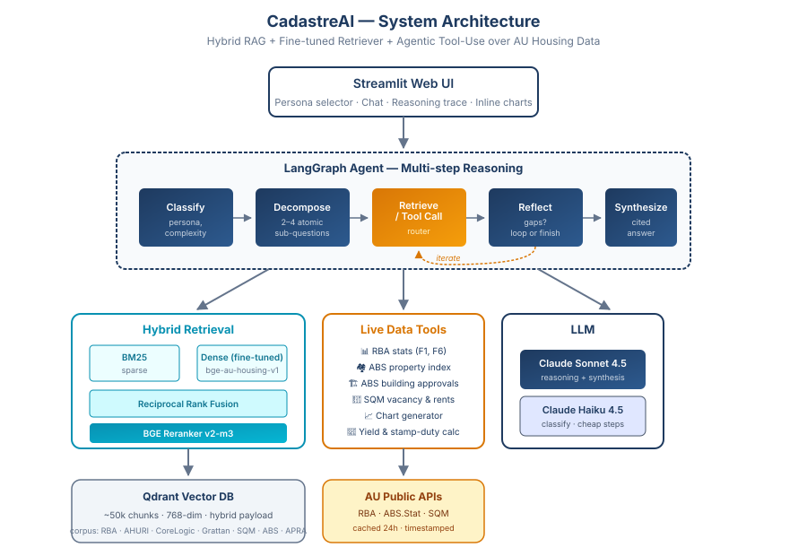

<div align="center">
  

  <h3>The property register, intelligent.</h3>

  <p>
    <strong>AI research agent for the Australian housing market</strong><br/>
    Domain-specialized RAG · Fine-tuned retriever · Agentic reasoning over RBA, AHURI, CoreLogic & live data
  </p>

  <p>
    <a href="#-demo">Demo</a> ·
    <a href="#-quickstart">Quickstart</a> ·
    <a href="#-results">Results</a> ·
    <a href="#-architecture">Architecture</a> ·
    <a href="./docs/blog.md">Blog post</a>
  </p>
</div>

---

## 🎬 Demo

> A 20-second walkthrough GIF of the Streamlit UI — persona switcher,
> streaming answer with inline citations, and the 5-step reasoning
> trace panel — will live here once recorded. Run it locally for now
> (see [Quickstart](#-quickstart)).

---

## 🏗️ What it does

CadastreAI answers questions about the Australian residential property market by combining a curated corpus of research reports with live data from government APIs. Four personas (first-home buyer, investor, policy researcher, journalist) get tailored responses, every claim is cited, and the reasoning trajectory is auditable in the UI.

**Example queries it handles well**:

- *"Is Parramatta a good bet for a family on $1.2M? What's the trend and yield?"* *(homebuyer)*
- *"Sydney suburbs with highest 3yr capital growth and vacancy under 3%"* *(investor)*
- *"How does CoreLogic's hedonic index differ from ABS 6432.0 methodologically?"* *(researcher)*
- *"What's the 5-year story on housing supply in NSW that I can cite in a piece?"* *(journalist)*

---

## 📊 Results

### Retrieval

The 100-query eval set has two groups with different provenance:

- **59 BM25-annotated** queries (Tasks 1.24–1.27): gold chunks were
  picked by humans from BM25 top-10 candidate lists, so any pure-BM25
  metric on this split is **circular by construction**.
- **41 synthetic** queries (Task 1.28): each gold chunk came first,
  the query was authored *for* that chunk with no retriever
  involvement. This is the honest head-to-head.

Reporting both splits matters: pooled numbers make BM25 look like the
clear winner, but that's the BM25-annotated split inflating the mean.
The honest split tells a different story.

**Honest split (41 synthetic queries, top-10):**

| Configuration                  | Recall@5  | Recall@10 | MRR@10    | nDCG@10   |
|--------------------------------|-----------|-----------|-----------|-----------|
| Dense (BAAI/bge-base-en-v1.5)  | 0.756     | 0.829     | 0.602     | 0.656     |
| BM25 only                      | 0.585     | 0.780     | 0.452     | 0.528     |
| **Hybrid (BM25 + Dense) + RRF** | **0.805** | **0.878** | **0.640** | **0.698** |

Hybrid wins every metric: +5 R@10 over dense, +10 R@10 over BM25. The
RRF fusion picks up rare domain terms (Division 43, FHG, NASHH, NFIP)
that BM25 nails but dense dilutes, while keeping dense's grasp on
paraphrased queries.

**Pooled (all 100 queries, for reference):**

| Configuration                    | Recall@5  | Recall@10 | MRR@10    | nDCG@10   |
|----------------------------------|-----------|-----------|-----------|-----------|
| Dense (BAAI/bge-base-en-v1.5)    | 0.383     | 0.450     | 0.352     | 0.349     |
| BM25 only                        | 0.800     | **0.907** | **0.732** | **0.760** |
| Hybrid (BM25 + Dense) + RRF      | 0.563     | 0.747     | 0.626     | 0.585     |
| Hybrid + cross-encoder rerank    | 0.550     | 0.673     | 0.560     | 0.537     |

The agent ships with hybrid as the default retriever (per Task 3.25)
based on the honest split. Full discussion of the circularity, the
fine-tune publisher-collapse failure mode, and per-persona breakdowns
in [`results/hybrid_comparison.md`](./results/hybrid_comparison.md)
and [`results/ablation.md`](./results/ablation.md).

### Agent

Agent eval over 30 queries with judge-graded faithfulness, three runs
(`results/agent_v1_vs_v2.md`, `results/agent_v2_vs_v3.md`):

| Metric                  | v1 (initial) | v2 (PR #106)  | v3 (PR #112)  |
|-------------------------|--------------|---------------|---------------|
| tool_acc                | 0.894        | 0.919         | 0.925         |
| tool_recall             | 0.956        | 0.978         | 0.944         |
| trajectory_efficiency   | 0.299        | **0.672**     | **0.722**     |
| faithfulness (judge)    | 0.570        | **0.648**     | 0.630         |
| groundedness (regex)    | 0.373        | 0.296         | 0.240         |

v2 dropped `MAX_ITERATIONS` 4 → 2 and tightened the reflect/synth
prompts (+0.37 trajectory, +0.08 faith). v3 swapped the retriever to
hybrid (Task 3.25 default). The aggregate looks flat because the
impact is route-conditional:

- **Tool-only queries (n=14):** within noise — retriever is a no-op
  when the agent doesn't pull docs.
- **Doc-using queries (n=14, apples-to-apples):** hybrid pulls +19%
  more chunks (8.93 vs 7.50) and synth's citation discipline slips
  — faithfulness -0.076, groundedness -0.138.

Hybrid stays the default (the retrieval benchmark on the honest
synthetic split says it should — R@10 0.878 vs 0.829), but the
agent's downstream synth doesn't capitalise on it yet. Three v4
follow-ups queued, sequenced by leverage: citation-adjacency in synth
prompt, lower agent `docs.k` 10 → 5/6, publisher-diversity rerank.

See [`docs/blog.md`](./docs/blog.md) for the full write-up.

---

## 🏛️ Architecture

<div align="center">
  
</div>

Three layers:

1. **Agent** (LangGraph, 5 nodes) — classifies query, decomposes complex questions, routes to retrieval or tools, reflects on gaps, synthesizes a cited answer. Loop-back capped at 4 iterations. Anthropic prompt caching on every system prompt for ~90% input-token discount on warm calls.
2. **Retrieval** — BM25 + dense BGE-base-en-v1.5 with Reciprocal Rank Fusion + optional cross-encoder reranker. Disk-cached query embeddings for sub-millisecond repeat lookups.
3. **Live data** — tool-use over RBA, ABS, SQM public endpoints + deterministic compute tools (mortgage, stamp duty, yield). Per-tool TTL cache (24h for upstream data, 7d for pure math).

Full design in [`product.md`](./product.md); engineering plan in [`project_plan.md`](./project_plan.md).

---

## 🚀 Quickstart

### Local (recommended for development)

```bash
git clone https://github.com/Hyeonu-Cha/CadastreAI
cd CadastreAI

# Environment — set ANTHROPIC_API_KEY and (optionally) QDRANT_API_KEY
cp .env.example .env

# Start Qdrant in the background
docker compose up -d qdrant

# Python env
python -m venv .venv && source .venv/bin/activate   # Windows: .venv\Scripts\activate
pip install -e ".[agent,index,embed,tools,app,chunk]"

# Ingest corpus (one-off, ~30 min on a laptop)
python -m src.ingest.run_all
python -m src.index.upsert

# Launch UI
streamlit run src/app/streamlit_app.py
```

### Docker (single-image runtime)

```bash
docker compose up -d qdrant         # Qdrant on :6333
docker build -t cadastreai:latest .
docker run --rm -p 8501:8501 \
    -e ANTHROPIC_API_KEY=sk-... \
    -e QDRANT_URL=http://host.docker.internal:6333 \
    cadastreai:latest
```

Open `http://localhost:8501`, pick a persona, ask a question.

---

## 🗂️ Repo structure

```
CadastreAI/
├── src/
│   ├── ingest/          # scrapers + PDF parsing (docling, PyMuPDF)
│   ├── index/           # Qdrant upsert + BM25 + hybrid + rerank
│   ├── retrieval/       # query-side retriever + on-disk embedding cache
│   ├── training/        # BGE fine-tuning pipeline (synthetic Q/A pairs)
│   ├── tools/           # RBA / ABS / SQM / compute / chart tool impls
│   ├── agent/           # LangGraph graph, nodes, persona, tool cache, cost
│   ├── eval/            # retrieval + agent eval harnesses
│   └── app/             # Streamlit UI + citation/disambiguation/trace
├── data/                # gitignored: raw PDFs, processed chunks, caches
├── docs/                # blog draft, architecture diagrams
├── results/             # eval JSON dumps for each retrieval config
├── tests/               # pytest unit + integration tests
├── Dockerfile           # multi-stage production image
├── docker-compose.yml   # Qdrant + optional Phoenix tracing
├── product.md           # product document (what & why)
└── project_plan.md      # engineering plan (how & when)
```

---

## 📝 Design docs

- **[`product.md`](./product.md)** — product requirements, personas, features, user flows, success metrics
- **[`project_plan.md`](./project_plan.md)** — 4-week engineering plan with daily tasks and checkpoints
- **[`docs/blog.md`](./docs/blog.md)** — technical deep-dive on fine-tuning and ablations
- **[`tickets.md`](./tickets.md)** — full ticket-level breakdown of the 4 weeks

---

## ⚠️ Disclaimer

CadastreAI is a research and education tool. Nothing it produces constitutes financial advice. Property decisions should involve a licensed buyer's agent, mortgage broker, solicitor, and financial adviser. Data accuracy depends on upstream sources (RBA, ABS, etc.) and may be stale between cache refreshes.

---

## 📜 License

Code: MIT. Corpus data is indexed for research use only; all reports remain the property of their original publishers (RBA, AHURI, CoreLogic/Cotality, Grattan Institute, SQM Research, etc.).

---

<div align="center">
  Built with Claude (Haiku 4.5 for routing/reflection, Sonnet 4.6 for synthesis), Qdrant, sentence-transformers, and LangGraph.<br/>
  <sub>A 4-week portfolio project</sub>
</div>
